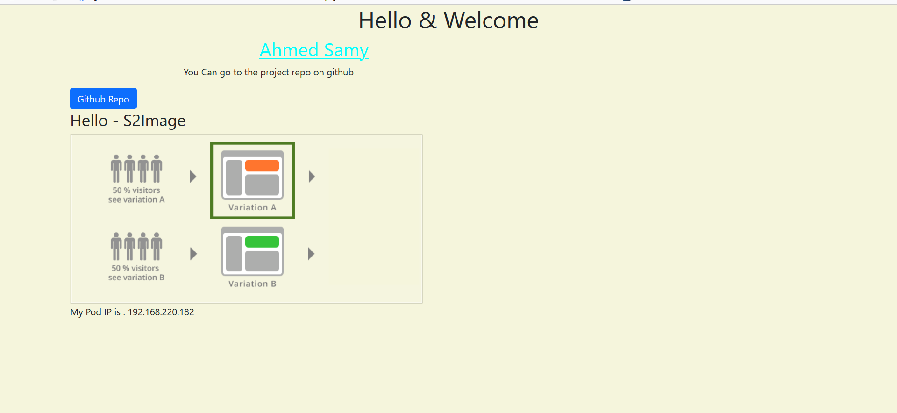

# Project : php-devops
## BY : Ahmed Samy
***
## DevOps CI/CD Pipeline for Microservices-Based E-Commerce Application
### Setup Instructions ....
***
## Prerequisites
1. Terraform - For infrastructure provisioning.
2. AWS CLI - For interacting with AWS resources.
3. Docker - For building containerized applications.
4. Ansible - For configuration management and automation.
5. Jenkins - For the CI/CD pipeline.
6. Helm - For managing Kubernetes applications.
7. kubectl - To interact with Kubernetes clusters.
8. git & Github repo.
***
* AWS Configuration (Access key & secret key) using php-devop profile
  - ```
      aws configure --profile php-devops
    ```
  - enter aws_access_key 
  - enter aws_secret_key
  - region "us-east-2"
  - format json
***
* Terraform infrastructure
  1. After creating terraform resources (provider,network,ec2,ecr,eks,iam-roles,s3) run commands :
      - to init aws provider with region (us-east-2) <br>
        ```
         terraform init
        ```
      <br>
      - to preview what terraform will do <br>
       ```
       terraform plan
       ```
       <br>
      - finally apply resources to run on AWS <br>
       ```
       terraform apply --auto-approve
       ```
       <br>
  2. Note: to copy **terraform.tfstate** from local to s3 bucket 
    - ```
      terraform init --migrate-state
      ```

***
* Ansible Automate Configuraions on ec2 instances (jenkins, sonarqube, vault).
  1. Make sure :
    - Your Ansible control node has access to your EC2 instances (via SSH).
    - You have updated your inventory file (instances) with the ip add of three instances.
    - ansible.cfg contained required configurations.
  2. to install any playbook within ansible dir
  ```
  ansible-playbook -i ./instances <playbook-name.yaml>
  ```
  - **Note** : if the  playbook including vault-vars.yaml 
  ```
  ansible-playbook -i ./instances <playbook-name.yaml> --ask-vault-pass
  ```
  3. ✅ After running these playbooks, Jenkins, SonarQube, and Vault will be ready, and Jenkins will be able to securely retrieve secrets from Vault to use in CI/CD pipeline stages.
***
*  CI/CD Pipeline Setup Instructions.
  1. Prerequisites:
    - Jenkins server (pre-installed via Ansible)
    - GitHub repository access.
    - Docker, AWS CLI, and sonar-scanner installed on Jenkins server.
    - Vault and SonarQube configured.
    - Amazon ECR and EKS set up and accessible.
    - Helm charts prepared for deployment.
  2. Add webhooks on github repo to jenkins be automatically build jenkinsfile when any changes push to github.
  3. The pipeline handles the following stages:

    -  ✅ Run Unit Tests

    - 🔍 Static Code Analysis with SonarQube

    -  🐳 Build Docker Image

    - 🔐 Fetch AWS Credentials from Vault

    - 🚀 Push Image to Amazon ECR

    - ⛵ Deploy to EKS using Helm
***
* Kubernetes Setup Instructions.
  1. Make sure kubectl is connected to the EKS Cluster using the appropriate kubeconfig file.
  ```
  aws eks update-kubeconfig --region us-east-2 --name eks
  ```
  2. Use Helm to install each microservice.
  3. using namespaces => (dev, staging, prod)
    - ex: 
    1. ```
        helm list --namespace prod
      ```
    2. ```
      kubectl get svc -n prod
       ```
  4. Apply Basic RBAC and Network Policies : ADD rbac.yaml within helm/templates.
  5. Enable Horizontal Pod Autoscaling (HPA) : ADD hpa.yaml within helm/templates.
    - Each microservice is configured with resource requests and limits in its Kubernetes Deployment manifest to ensure efficient scheduling and cluster stability.
  6. After that for testing app: copy url when run ```kubectl get svc -n prod``` and run it on browser.
  

***
* Security Implementation
  1.  IAM Roles with Least Privilege
    - Create dedicated IAM Roles for each service (Jenkins, EKS Nodes, EC2 instances) following the principle of least privilege.
      1. jenkins EC2 Instance: Attach an IAM instance profile that allows access to ECR, EKS, and Vault.
      2. EKS Worker Nodes: Use IAM instance profiles to grant access to AWS resources.
      3. Kubernetes Pods: For fine-grained security, configure IRSA (IAM Roles for Service Accounts) to give specific pods access to AWS services securely, without sharing credentials.
  2. Secrets Management via Vault
    - using Secret engine KV1 that use credentials inside /secret
    - Add secrets such as SonarQube credentials and AWS credentials
    - Create a Vault policy to restrict access to specific paths.
    - Integrate Jenkins with Vault using the Vault plugin.
    - This ensures secrets are never hardcoded into code or Helm charts and are managed securely with access control.


  
  


 